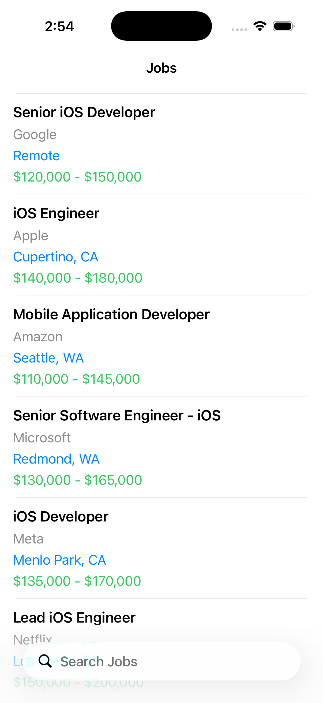

# JobFinder

JobFinder is a production-ready iOS application built using UIKit, MVVM architecture, Dependency Injection, and Async/Await. The application allows users to browse available jobs, search jobs by title or company, and view detailed job information.

## Screenshots

| Job List | Job Detail |
|----------|------------|
|  |  |

## Features

* Browse available jobs
* Search jobs by title
* Search jobs by company
* View detailed job information
* Loading state handling
* Empty state handling
* Error state handling
* Unit testing with business logic coverage

## Tech Stack

* Swift 5+
* UIKit
* MVVM Architecture
* Async/Await
* Dependency Injection
* XCTest

## Project Structure

```text
JobFinder
│
├── Application
│   ├── AppDIContainer.swift
│
├── Core
│   ├── Constants
│   └── Extensions
│
├── Domain
│   ├── Models
│   ├── Repositories
│   └── Services
│
├── Data
│   ├── Repository
│   ├── Services
│   └── MockData
│
├── Presentation
│   ├── JobList
│   ├── JobDetail
│   └── Common
│
└── JobFinderTests
```

## Architecture

The application follows the MVVM (Model-View-ViewModel) architecture.

### Model

Represents job data and business entities.

### View

Responsible for rendering UI and forwarding user actions to the ViewModel.

### ViewModel

Contains presentation and business logic, including:

* Fetching jobs
* Search functionality
* State management

### Repository

Acts as an abstraction layer between the ViewModel and data source.

### Service

Responsible for loading and decoding job data from the local JSON source.

### Dependency Injection

Dependencies are injected through constructors to improve testability and maintainability.

## Setup Instructions

### Prerequisites

* Xcode 16 or later
* iOS 18.0+
* Swift 5+

### Run the Project

1. Clone the repository

```bash
git clone https://github.com/gurisimran302-coder/JobFinder.git
```

2. Open the project

```bash
open JobFinder.xcodeproj
```

3. Select an iOS Simulator

4. Press:

```text
⌘ + R
```

to run the application.

## Running Unit Tests

Run tests using:

```text
⌘ + U
```

or:

```text
Product → Test
```

To view code coverage:

```text
Product → Scheme → Edit Scheme → Test
```

Enable:

```text
Gather Coverage for JobFinder
```

Then view coverage in:

```text
Report Navigator → Coverage
```

## Data Source

The application uses a local JSON file:

```text
Data/MockData/jobs.json
```

which simulates a remote API response.

## Assumptions Made

* A local JSON file was used instead of a remote API to keep the assessment self-contained and easily executable.
* Search functionality is case-insensitive.
* Search is performed against job title and company name.
* Job data is loaded during application startup.
* Pagination and image loading were considered out of scope for this assignment.
* Error handling is implemented for missing files and JSON decoding failures.
* The architecture was designed to allow future migration from local JSON to a remote API with minimal changes.

## Testing

Unit tests have been implemented for:

* JobListViewModel
* JobDetailViewModel
* JobService

Covered scenarios include:

* Successful job loading
* Empty responses
* Error handling
* Search by title
* Search by company
* Case-insensitive search
* Empty search text
* No result searches
* Job detail data validation

## Author

Gursimran Singh
(Senior iOS Developer)
